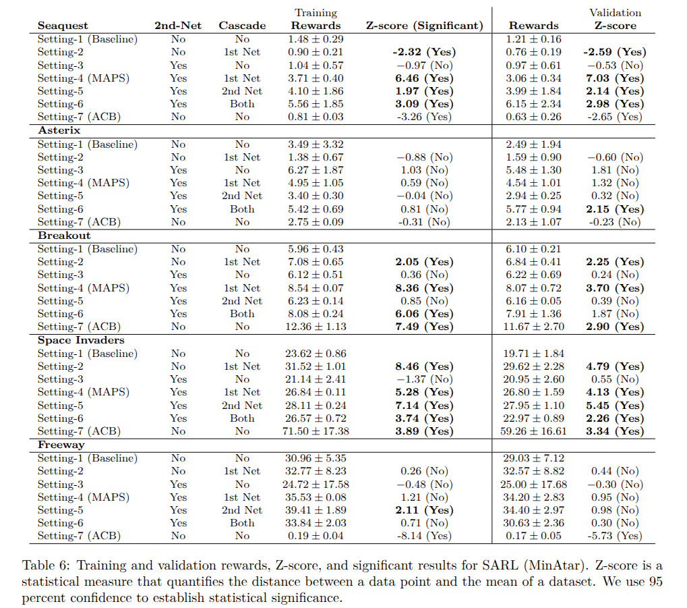
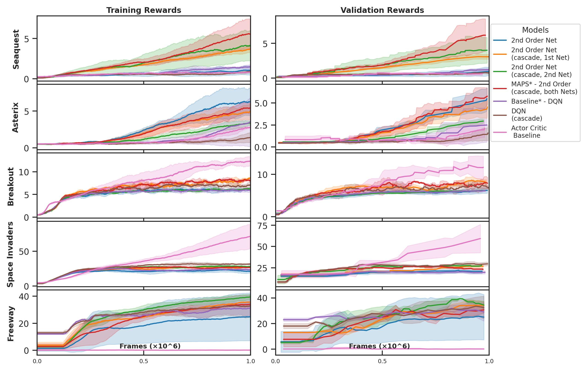

# MAPS: A Metacognitive Architecture for Improved Social Learning

This repository contains the implementation of MAPS (Metacognitive Architecture for Improved Social Learning) as described in our paper published in the Proceedings of the International Workshop on Advancing AI Through Theory of Mind, 2025. 
[TOM4AI Workshop proceedings](https://arxiv.org/abs/2505.03770)
[Full length paper - preprint](pdf/MAPS_TMLR_Journal_Submission.pdf)


## Authors
- Juan David Vargas (Université de Montréal, MILA - Quebec AI Institute, CHU Sainte-Justine)
- Natalie Kastel (CHU Sainte-Justine, MILA - Quebec AI Institute, Université de Montréal)
- Antoine Pasquali (Université libre de Bruxelles)
- Axel Cleeremans (CrossLabs)
- Zahra Sheikhbahaee* (CHU Sainte-Justine, MILA - Quebec AI Institute)
- Guillaume Dumas* (CHU Sainte-Justine, MILA - Quebec AI Institute, Université de Montréal)

*Co-Senior Authors

## Overview

MAPS is a novel architecture that combines metacognitive components with advanced learning techniques. The key components include:

1. A secondary network (2nd-Net) with a comparator matrix connected to wagering units
2. A cascade model facilitating graded accumulation of activation

Our experiments demonstrate significant performance improvements across multiple domains including Blindsight, Artificial Grammar Learning (AGL), Single-Agent Reinforcement Learning (SARL), and Multi-Agent Reinforcement Learning (MARL). We test our architecture over 6 settings, alternating with these 2 components on and off. 

   


## Methodology

- **Primary Network**: Main neural network with contrastive loss
- **Secondary Network**: Comparator matrix connected to two wagering units
- **Cascade Model**: Facilitates graded accumulation of activation (typically 50 iterations)
- **SARL Implementation**: DQN framework with convolutional layers, autoencoder, and replay buffer
- **MARL Implementation**: MAPPO framework with convolutional layers, sinusoidal-based relative positional encoding, and Gated Recurrent Unit (GRU)

## Installation

Clone the repository and install the requirements:

```bash
#Download conda installer here: https://www.anaconda.com/download/success
bash $anacoda_file
conda create --name MAPS python=3.11
conda activate MAPS
git clone https://github.com/juandavidvargas19/MAPS_PROJECT.git
cd MAPS_PROJECT
pip install -r requirements.txt
```

Additionall requirements for SARL:

```bash
cd SARL/MinAtar
pip install .
```

Additionall requirements for MARL:

```bash
cd ..
cd MARL
pip install "ray[cpp]" 
git clone -b main https://github.com/deepmind/meltingpot
cd meltingpot
pip install --editable .[dev]
```


## Experiments

This repository includes code for reproducing the experiments described in the paper:

### 1. Blindsight

   


```bash
cd BLINDSIGHT
python Blindsight_TMLR.py
```

### 2. Artificial Grammar Learning (AGL)

```bash
cd AGL
python AGL_TMLR.py
```

### 3. Single-Agent Reinforcement Learning (SARL)

   


The SARL experiments are conducted on MinAtar environments. The experiments recorded on the short version of our paper use "Seaquest" and "Asterix". However, you can run "Breakout", "Space Invaders", "Freeway", "Seaquest" and "Asterix". To run SARL, there are 3 experiments: standard (running a single environment), transfer learning, and continual learning. 

For each of this cases, you need to change the generic variable = $general_dir to $local_repo_directory/SARL/MinAtar. Then for each case you need to run:

Standard run ( environment, seed, setting) 
```bash
cd SARL/ 
./SARL_Training_Standard.sh BREAK 1 1
```
You can change BREAK for the corresponding environment. Please see the script in SARL_Training_Standard.sh to change the corresponding flag name for each environment.


   

Transfer learning ( setting, number_steps)
```bash
cd SARL_CL/ 
./SARL_Training_TransferLearning_TernaryPlot.sh 1 100000
```

Continual learning ( seed, setting)
```bash
cd SARL_CL/ 
./SARL_Training_ContinuousLearning.sh 1 1
```

### 4. Multi-Agent Reinforcement Learning (MARL)

   


MARL experiments include Harvest Cleaner, Harvest Planter, Chemistry 3D, and Territory Inside Out environments. However there are more than 20 environments compatible that you can try.

For each of this cases, you need to change the generic variable = $general_dir to $local_repo_directory/MARL. Then for each case you need to run:

Standard run (with 2nd order network)
```bash
cd MARL/
./meltingpot.sh TERRITORY_I 10 LSTM 100 1 1 META ADAM 101 1 True 0
```

Standard run (without 2nd order network)
```bash
cd MARL/
./meltingpot.sh TERRITORY_I 10 LSTM 100 1 1 META ADAM 101 1 False 0
```

You can change TERRITORY_I for the corresponding environment. Please see the script in meltingpot.sh to change the corresponding flag name for each environment.

## Results Summary

Our results demonstrate significant improvements using the MAPS architecture:

1. **Blindsight and AGL**: 
   - Blindsight: 0.97 +/- 0.02 (Z-score: 9.01)
   - AGL- High Awareness: 0.66 +/- 0.05 (Z-score: 8.20)
   - AGL- Low Awareness: 0.62 +/- 0.07 (Z-score: 15.70)


   
   
2. **MinAtar SARL**: 
   - Seaquest: 3.06 +/- 0.34 (Z-score: 7.03)
   - Asterix: 4.54 +/- 1.01 (Z-score: 1.32)
   - Breakout: 8.07 +/- 0.72 (Z-score: 3.70)
   - Space Invaders: 26.80 +/- 1.59 (Z-score: 4.13)
   - Freeway: 34.20 +/- 2.83 (Z-score: 0.95)
      
   

   

4. **MinAtar SARL + continual/transfer learning**: 
   - Achieved a mean retention of 45.1% +/- 31.1% for transfer learning. Results for continual learning are still exploratory.
     

5. **MARL**: 
   - Commons Harvest Partnership: 34.52 +/- 0.98 (Z-score: 6.20)
   - Commons Harvest Closed: 25.21 +/- 1.06 (Z-score: 6.31)
   - Chemistry: 1.11 +/- 0.05 (Z-score: -0.91)
   - Territory Inside Out: 48.47 +/- 1.45 (Z-score: -1.92)
      
     
     


## Citation

If you use this code in your research, please cite our paper:

```
@inproceedings{vargas2025maps,
  title={MAPS - A Metacognitive Architecture for Improved Social Learning},
  author={Vargas, Juan David and Kastel, Natalie and Pasquali, Antoine and Cleeremans, Axel and Sheikhbahaee, Zahra and Dumas, Guillaume},
  booktitle={Proceedings of the International Workshop on Advancing AI Through Theory of Mind},
  year={2025}
}
```
